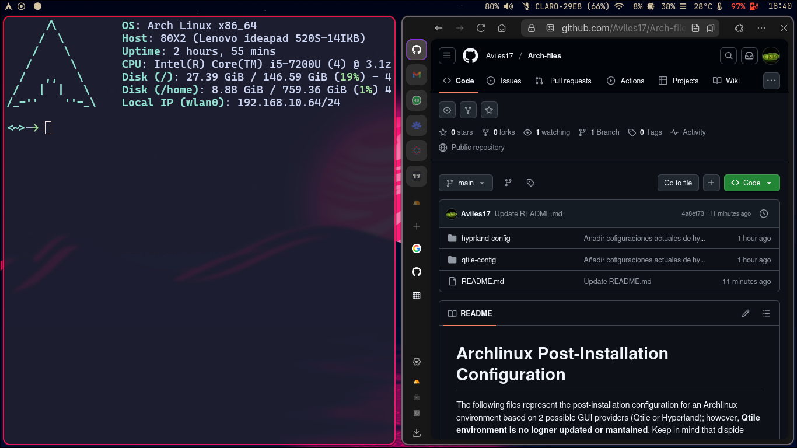

# Arch-files — Configuración Post-Instalación de Arch Linux

Este repositorio contiene la configuración post-instalación de un entorno Arch Linux, históricamente soportado sobre 2 gestores de ventanas/compositores: **Qtile** e **Hyprland**. **El entorno de Qtile ya no se actualiza ni se mantiene** — se conserva solo como referencia histórica. La configuración activa y mantenida es la de **Hyprland**.

Aunque Hyprland es un compositor Wayland (no un gestor basado en Electron), la mayoría de las aplicaciones recomendadas son **GTK**, para que respeten el theming aplicado de forma consistente en todo el escritorio.

## Estructura del repositorio

| Carpeta | Estado | Descripción |
|---|---|---|
| [`hyprland-config/`](./hyprland-config/README.md) | ✅ Activo | Configuración actual del escritorio (Hyprland + apps asociadas). Ver el README de la carpeta para el detalle de cada archivo y la guía de instalación. |
| `qtile-config/` | ⚠️ Legacy, sin mantenimiento | Configuración antigua de Qtile. Se conserva como referencia, no se recomienda para una instalación nueva. |

## Recomendaciones de SO y hardware

- SO: imagen más reciente de **Arch Linux**, con las llaves de pacman actualizadas (`pacman-key --refresh-keys`).
- Partición `/home`: para archivos de usuario, no para software (recomendado 50% o menos del disco si usás muchas herramientas de desarrollo que van en `/`).
- Partición `/`: para el sistema y los paquetes (recomendado 50% o más si sos desarrollador).
- Swap: igual a la cantidad de RAM disponible.
- WM/Compositor: **Hyprland**.
- Instalar los drivers de Intel o AMD según corresponda a la CPU/GPU.

## Resumen de la configuración de Hyprland

Ver [`hyprland-config/README.md`](./hyprland-config/README.md) para la explicación completa de cada archivo y los pasos de instalación en un sistema nuevo. En resumen:

- Todas las configuraciones de Hyprland (y del software asociado) están en **`hypr/`**.
- **waybar/** para la barra de estado (módulos y estilos).
  - Se recomienda tener instalada al menos una Nerd Font.
- **wofi** como lanzador de aplicaciones.
- **Thunar** (GTK) como explorador de archivos — se recomienda desinstalar Dolphin (Qt) para evitar mezclar toolkits.
- Navegador a elección; la configuración actual usa **Zen Browser** (`SUPER + B`).
- **Hyprshot** para capturas de pantalla en alta definición.
- **dunst** como daemon de notificaciones (incluye la alerta de batería baja, ver `waybar/scripts/battery_alert.fish`).

### Pantalla de login (SDDM)

Para autenticación y login se usa **SDDM**, con el tema [sddm-astronaut](https://github.com/Keyitdev/sddm-astronaut-theme). El tema **no se versiona dentro de este repositorio** (es un proyecto de terceros con sus propios assets, fuentes y componentes QML); se instala desde:

- Fork de respaldo (backup) mantenido por el autor de este repo: [Aviles17/sddm-backup-repo](https://github.com/Aviles17/sddm-backup-repo)
- Proyecto original: [Keyitdev/sddm-astronaut-theme](https://github.com/Keyitdev/sddm-astronaut-theme)

## Terminal (Kitty + Fish)

- Se recomienda tener instalada al menos una Nerd Font para los íconos del prompt y de kitty.
- Usar los archivos de configuración de **Kitty** provistos en `hyprland-config/kitty/`.
- Usar **fish** con **Oh My Fish (OMF)**. `hyprland-config/fish/config.fish` invoca `fastfetch` al abrir una sesión interactiva — por eso `fastfetch` se lista como **dependencia de pacman**, no como un archivo de configuración aparte.
- Instalar **htop** y **cmatrix** vía pacman para una mejor experiencia de terminal.

## Software adicional

- **NetworkManager** (`nmcli`): gestión de conexiones Wifi/Ethernet.
- **ProtonVPN**: VPN para enmascarar la IP en redes públicas.
- **PortMaster**: firewall y seguridad de conexiones. Es una aplicación independiente que se descarga por separado y no requiere configuración especial versionable en este repo.
- **Sublime Text** y **Code — OSS**: editores de texto/código recomendados.
- **Neovim**: instalado en el sistema, pero actualmente sin uso activo ni configuración propia — no forma parte del flujo de trabajo documentado aquí.
- **PipeWire** (con `pipewire-pulse`): gestión de audio y micrófono (reemplaza a PulseAudio en instalaciones recientes).

## Notas de mantenimiento

- Los temas Qt (**Kvantum**, **qt5ct**) fueron evaluados y **descartados intencionalmente** de este repositorio: no aportan impacto visual real en la configuración actual (ver el detalle en `hyprland-config/README.md`).
- Antes de versionar un archivo de configuración nuevo, verificar que no sea estado interno regenerable (cachés, bases de datos de variables universales de fish, símlinks de gestores de paquetes como OMF) — este tipo de archivos no debe vivir en el repo.
